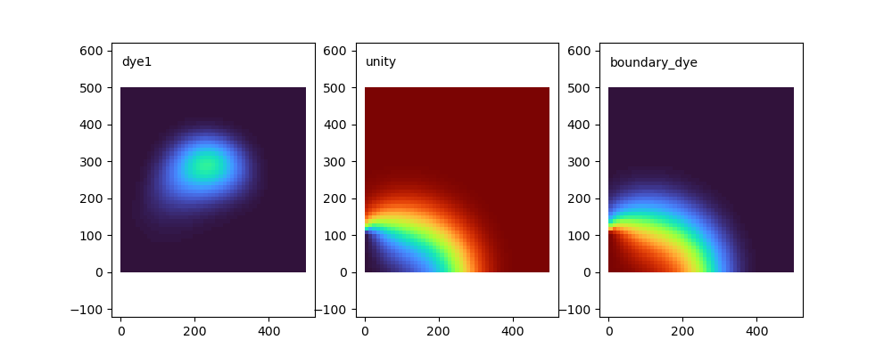

This directory shows an example of scripting the creation and execution of a very
simple DFlowFM simulation, and a subsequent scalar simulation using DWAQ.

The hydrodynamic model is a 500m square grid with a resolution of 10m.  The southern
end of the western boundary has a periodic flow.  It runs for 48 hours.

The D-WAQ tracer run includes three tracers:

 - dye1 is initialized as a Gaussian blob in the middle of the domain, and 0 on the flow boundary
 - unity is initalized as 1.0, with 0.0 on the flow boundary.
 - boundary_dye is initialized as 0.0, with 1.0 on the flow boundary.
 
At the end of the simulation the three tracers look like:

